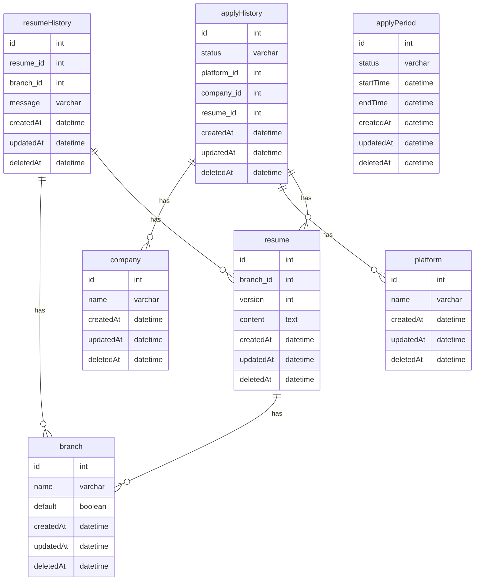

# ERD DIAGRAM 

```mermaid
erDiagram

branch {
    id int
    name varchar
    default boolean
    
    createdAt datetime
    updatedAt datetime
    deletedAt datetime
}


resume{
    id int 
    branch_id int
    version int 
    content text 
    
    createdAt  datetime
    updatedAt datetime
    deletedAt datetime
}

resume ||--o{ branch: has


resumeHistory {
    id int
    resume_id int 
    branch_id int
    message varchar
    
    
    
    createdAt  datetime
    updatedAt datetime
    deletedAt datetime
}

resumeHistory ||--o{ branch: has
resumeHistory ||--o{ resume: has
  
company {
    id int 
    name varchar
    
    createdAt  datetime
    updatedAt datetime
    deletedAt datetime
}

platform {
    id int 
    name varchar

    createdAt  datetime
    updatedAt datetime
    deletedAt datetime
    
}


applyHistory {
    id int 
    status varchar
    platform_id int 
    company_id int 
    resume_id int
    
    createdAt  datetime
    updatedAt datetime
    deletedAt datetime
    
    
}

applyHistory ||--o{ company: has
applyHistory ||--o{ platform: has
applyHistory ||--o{ resume: has

applyPeriod {
    id int
    status varchar 
    startTime datetime
    endTime datetime
    
    createdAt  datetime
    updatedAt datetime
    deletedAt datetime
    
}


```